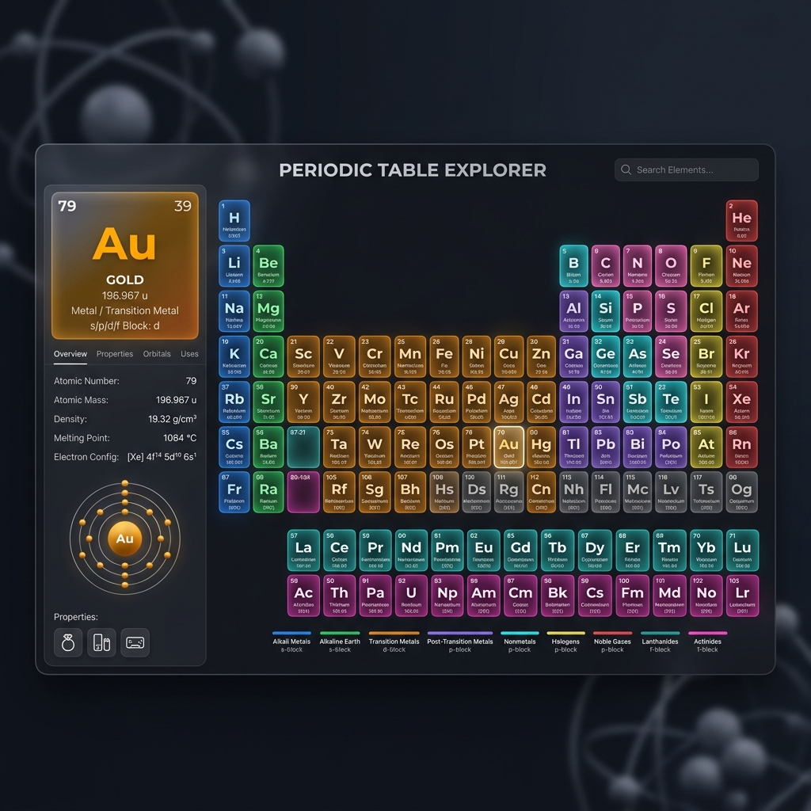

# 🧪 Periodic Table Explorer



## 🏆 NSoC'26 Selected Project

This project is a featured part of the **Nexus Spring of Code 2026**. We welcome all contributors! Check the [Contributing Guidelines](CONTRIBUTING.md) to join the journey.

---

**Periodic Table Explorer** is a state-of-the-art, interactive web application built with React. It provides a stunning, high-fidelity visualization of the chemical elements, designed to make scientific exploration both beautiful and intuitive.

## ✨ Key Features

-   **💎 Premium Glassmorphism UI**: A modern design language featuring semi-transparent cards, subtle blurs, and vibrant gradients.
-   **🌓 Dynamic Dark Mode**: Fully optimized light and dark themes with smooth transitions.
-   **📱 Responsive Architecture**: Fluid grid system that adapts perfectly to desktops, tablets, and mobile devices.
-   **🔍 Intelligent Search & Filter**: Real-time fuzzy search and advanced filtering by block (s, p, d, f), period, and group.
-   **📊 Deep Element Insights**: Comprehensive data for every element, including atomic properties, physical phases, and 3D Bohr models.
-   **⚗️ Interactive Quiz Mode**: Test your knowledge with a built-in interactive quiz.
-   **⚡ High Performance**: Optimized with React best practices for lightning-fast interactions and smooth animations.

## 🛠️ Tech Stack

-   **Core**: [React](https://reactjs.org/)
-   **Styling**: Vanilla CSS (Custom Design System)
-   **Icons/Media**: Lucide Icons & Custom SVG Assets
-   **Data**: Curated JSON Elements Dataset

---

## 🚀 Getting Started

### Prerequisites

-   **Node.js**: v18.0.0 or higher
-   **npm**: v8.0.0 or higher

### Installation

1.  **Clone the Repository**
    ```bash
    git clone https://github.com/KGFCH2/Periodic-Table-Explorer.git
    ```

2.  **Install Dependencies**
    ```bash
    cd Periodic-Table-Explorer
    npm install
    ```

3.  **Run the Development Server**
    ```bash
    npm start
    ```

4.  **Explore**
    Open [http://localhost:3000](http://localhost:3000) in your browser.

---

## 🤝 Contributing

We love contributions! Whether it's a bug fix, a new feature, or documentation improvements, please read our [CONTRIBUTING.md](CONTRIBUTING.md) to get started.

## 📄 License

This project is licensed under the MIT License - see the [LICENSE](LICENSE) file for details.
